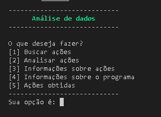

# Análises de ações
(https://github.com/CelestialDev/Analises_de_acoes/blob/main/LICENSE)
# Sobre o Projeto
Análise de Ações é um programa em terminal desenvolvido em python, no qual busca, análisa e guarda ações.

    

## Buscar ações
O programa pode buscar ações com base na sua escolha, ou seja, por busca específica, ou geral. 

    

### Buscando ações em alta
O programa pode buscar ações do dia, com base no indíce que quiser.

    

## Analisar ações
Você poderá escolher as planilhas de ações pesquisadas pelo programa

    

## Guardar ações
No caso de você ter comprado algumas ações, você pode registrar suas ações obtidas no programa, e toda vez que quiser atualizar suas ações, o programa
irá trazer a cotação da mesma, multiplicando-a com a quantidade de ações que obteu, resultando no seu total.

    

